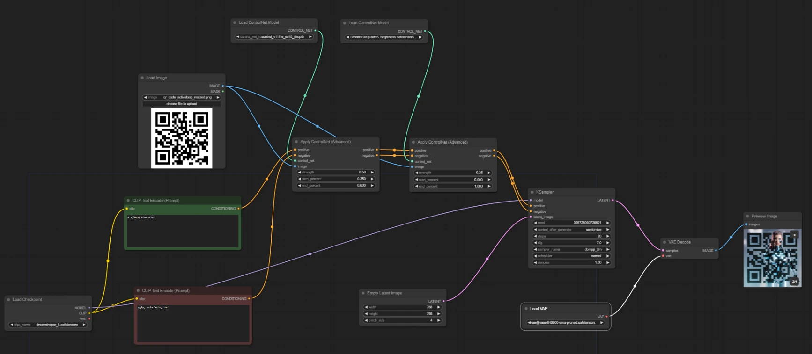
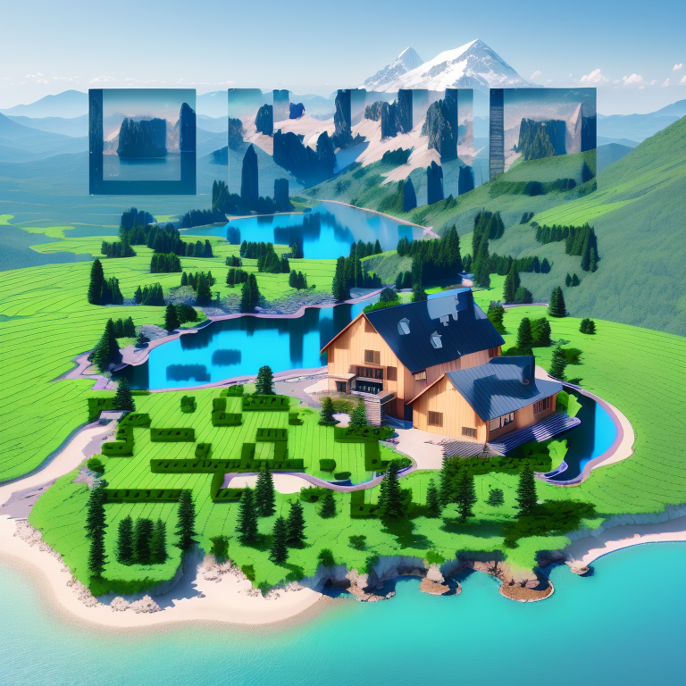
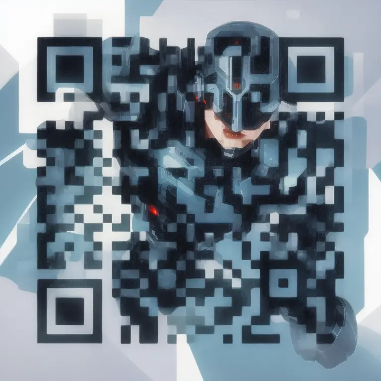

# Creating Artistic QR Codes at Scale Using LangChain and ControlNet

## Summary
We built a tool that can generate artistic QR codes for a specific website/url with the use of [Deep Lake](https://www.activeloop.ai/), [LangChain](https://python.langchain.com/docs/get_started/introduction.html), [Stable Diffusion](https://www.activeloop.ai/resources/glossary/stable-diffusion/) and [ControlNet](https://github.com/Mikubill/sd-webui-controlnet) via [AUTOMATIC1111](https://github.com/AUTOMATIC1111/stable-diffusion-webui) and [ComfyUI](https://github.com/comfyanonymous/ComfyUI). If you want to try the code directly from our notebook, just download it from the [repository](https://github.com/efenocchi/QRCodeGenerator/blob/main/QRCode_article.ipynb).

```python
activeloop_org = "YOUR_ACTIVELOOP_ORG_ID"
# initialize the embedding model
embeddings = OpenAIEmbeddings()

# initialize the database, can also be used to load the database
db = DeepLake(
    dataset_path=f"hub://{activeloop_org}/scraped-websites",
    embedding=embeddings,
    overwrite=False,
)

# save the documents
db.add_documents(docs)
```

### Step 2: Saving the Documents Along With Their Embeddings to Deep Lake
Once the website is scraped and pages are split into documents, it's time to generate the embeddings and save them to the Deep Lake. This means that we can come back to our previously scraped data at any time and don't need to recalculate the embeddings again. To do that, you need to set your `ACTIVELOOP_ORGANIZATION_ID`.

### Step 9: Hands on with ComfyUI
A different approach from the one listed above can be obtained by taking advantage of ComfyUI which is a powerful and modular stable diffusion GUI.
The main idea is to create a schema from the proposed GUI and transform this schema into code thanks to an extension called `ComfyUI-to-Python-Extension`.
We need to load the Stable Diffusion and the ControlNet checkpoints we want to use. 

In our case we experimented with:
- Diffusion models: `v1-5-pruned-emaonly`, `dreamshaper_8` and `revAnimated_v122EOL` 
- ControlNet models: `control_v1p_sd15_brightness`, `control_v1p_sd15_qrcode`, `control_v11f1e_sd15_tile` and `control_v11f1p_sd15_depth`.



### Some Examples
 
 
